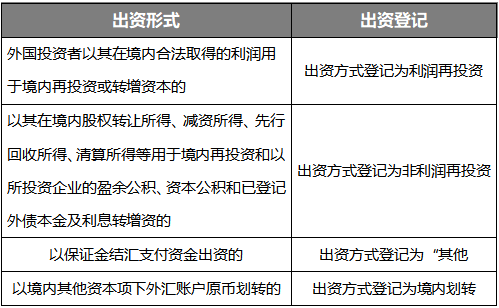

# FDI简介 

- 2025年2月25日；星期二 ；晴

| 序号 |  作者   |   场景类型   |
| :--: | :-----: | :----------: |
|  1   | **我**😀 | 国际业务知识 |

今日感受：

    

        
上午<a href="#">：</a>

        

            命运。
        

    

    

        
下午<a href="#">：</a>

        

            当下。
        

    

------------------------------------------------------------------------------------------------------------------------------------------------------------------

**概念**

外商境内直接投资，是指外国投资者（包括境外机构和个人）通过新设、并购等方式在境内设立外商投资企业或项目，并取得所有权、控制权、经营管理权等权益的行为。

FDI(Foreign Direct Investment)。按照国际货币基金组织(IMF)的定义FDI是指一国的投资者将资本用于它国的生产或经营,并掌握一定经营控制权的投资行为。一般在我国FDI表示的是“外商直接投资”，或更一般的称作”Inward FDI”。“对外直接投资”对应的英文是“outward FDI，即ODI”。

外商直接投资（FDI）对我国经济产生了积极影响，包括:扩大我国外贸规模，改善我国外贸结构，促进对外贸易的发展；增加国内投资积极性、促进资本发展；扩大劳动力规模，提高就业率；是我国重要的税收来源之一。

**实务探析**

**（一）关于出资方式**

外国投资者设立外商投资企业或并购境内企业，不仅可以用货币出资，还可以用非货币财产作价出资。对于投资者而言，需要以自身的需求选择出资方式；对于银行端而言，则需要区分出资方式，在资本项目信息系统中办理登记。

货币出资是最为常见的方式。外国投资者可以通过跨境流入人民币、外汇的方式出资；也可以用其在境内合法取得的利润出资；以其在境内股权转让所得、减资所得等出资。货币出资方式简单明了，操作和管理便利。

股权出资是指，股东将其持有的另外一个公司的股权作为出资财产出资到被投资企业。如，外国投资者A将B公司的股权出资到C公司，出资完成后，外国投资者A成为C公司的股东，而C公司成为B公司的股东。

其他出资形式见下表：

**（二）关于资本金的使用**

外资要入境，首先需要做FDI登记，也就是外商投资企业在领取营业执照后，需到辖内银行办理外汇登记，取得业务登记凭证。优化外汇管理后，FDI只涉及外汇登记，无需发改委和商务部审批，手续简便。境外资金进入国内企业，主要目的是为了在境内使用，并通过资金的运用获得相应的收益。因此，资本金在什么情况下可以用，会不会受到限制，是市场主体最关心的问题。

**★资本金用于投资理财**

明确禁止直接或间接用于证券投资，对于其他投资理财，明确只允许购买风险等级不超过R2级的理财产品或结构性存款。理财产品分为5类基本风险等级，R2级属于中低风险，投资范围与R1级相似，主要包括各种债券、货币市场基金等，总体上相对稳定、风险较低。结构性存款也是一种理财产品，一般结构性存款投资固定收益类产品及衍生品。至于定期存款、大额存单、协定存款均属于存款，不在负面清单之列，因此，如案例中，资本金是可以购买大额存单的。

**★资本金用于发放贷款**

除了经营范围明确许可的情形和4个试点区域外，禁止向非关联方发放贷款。也就是说，资本金允许用于向关联企业发放委托贷款。这里有两点需要注意，一是委托贷款必须通过银行发放；二是关联企业，《公司法》规定，关联关系是指公司控股股东、实际控制人、董事、监事、高级管理人员与其直接或间接控制的企业之间的关系，以及可能导致公司利益转移的其他关系。

**★资本金用于购买房产**

**这里有两个关键词“非自用”、“住宅性质房产”，**首先，只有从事房地产开发经营的企业和从事房产租赁的企业，才可以购买非自用的房产；其次，资本金可以购买自用的非住宅性质房产，即房等写字楼、厂房等商业地产。

**这里有个问题待理清**。如案例中的W公司，计划用资本金购买酒店和商业楼，用于出租和酒店经营，属于非住宅性质房产，是否可行？

笔者认为，资本金是否可用于非住宅性质房产，关键在于“自用”，也就是是否用于自身经营范围内的经常项下支出。案例中W公司的经营范围包括酒店经营，建设或购买酒店属于“自用”，是可行的。但是，如果资本金用于购买商业楼出租，则属于非自用，不可行。因为该企业的经营范围并不包括房地产租赁经营。

**（三）关于境内再投资**

外商投资企业“境内再投资”，指外商投资企业以人民币资本金或外汇资本金或其结汇所得人民币资金本，在中国境内投资设立企业或开展境内股权投资的行为。涉及境内再投资有两个关键点，一是外商投资准入特别管理措施（负面清单）；二是外汇登记。

**★境内再投资需要进行外汇登记吗？**

需要区分被投资企业注册地是否为高水平开放试点地区。这里解释一下，2023年12月15日，国家外汇管理局发布《关于扩大跨境贸易投资高水平开放试点的通知》（汇发[2023]30号），其中一项资本项目政策措施为“外商投资企业境内再投资免登记”。因30号文是总局将权限下发给各分局，各分局制定相应的细则，所以关于境内再投资外汇登记规定需以各地分局的细则为准，下面以笔者所在的试点地区广东省为例：

外商投资企业开展境内再投资时，注册在国家外汇管理局广东省分局辖内的被投资企业或股权出让机构无需办理接收境内再投资登记（房地产企业除外）。按照接收再投资资金是否需要开立专户区分以下几种情形。

- **第一种情形，开立外汇资本金账户。**被投资企业接收外商投资企业（包括投资性外商投资企业、非投资性外商投资企业）以外汇支付新设或增资款项的，需开立外汇资本金账户接收投资款；
- **第二种情形，开立资本项目结算账户。**股权出让机构接收外商投资企业（包括投资性外商投资企业、非投资性外商投资企业）以外汇支付股权出让对价的，需开立资本项目结算账户收取转股对价；
- **第三种情形，开立结汇待支付账户。**非投资性外商投资企业以人民币形式（直接结汇所得人民币或结汇待支付账户内的人民币）进行境内再投资，被投资企业需开立结汇待支付账户接收再投资资金；
- **第四种情况，无需开立专户。**被投资企业接收外商投资企业（包括投资性外商投资企业、非投资性外商投资企业）以跨境人民币再投资的，无需开立人民币资本金专用存款账户；涉及股权出让交易的，相关人民币资金可直接划转至股权出让机构的境内人民币账户。

**易混淆的点**

银行端实操时，容易将境内再投资和利润再投资混淆。外国投资者以其在境内合法取得的利润用于境内再投资，实质上还是属于外国投资者在境内投资新设/并购外商投资企业，出资方式为利润再投资。 

